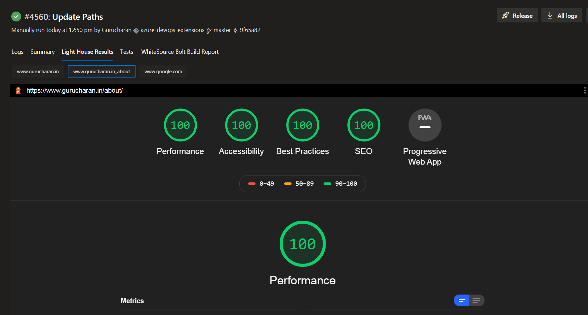
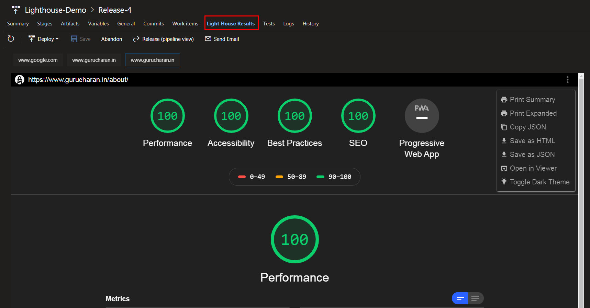

# Google Lighthouse extension for Azure Devops

From the [docs](https://developers.google.com/web/tools/lighthouse), Lighthouse is an open-source, automated tool for improving the quality of web pages. It has audits for performance, accessibility, progressive web apps, SEO and more. You give Lighthouse a URL to audit, it runs a series of audits against the page, and then it generates a report on how well the page did.

This extension runs the Lighthouse scan as part of your Azure Pipelines and publishes the reports as part of your pipeline results.

## Getting Started

Once the extension is installed, you will see a task that you can use in build / release steps. Below is a screenshot of a sample build pipeline.

You can see the Lighthouse results as a separate tab part of the build summary containing scan results of all the different pages that were scanned.

Lighthouse scan results are available in a separate tab as part of release summary and **viewable only in older release view**.

## Contact

- For issues, bugs, and feature requests, please [raise an issue](https://github.com/GuruCharan94/azure-devops-extensions/issues/new).
- You should also join us in the [Azure DevOps Slack Channel](http://www.azuredevops.club/).
